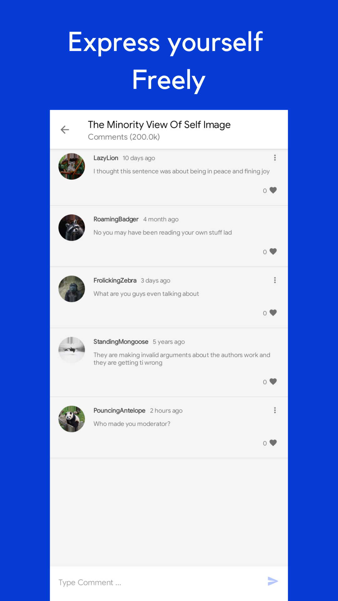

# Poetree

 

## Overview

The open community built for poetry lovers.

Poetree is a minimalistic poetry app that helps people freely access art from a global community full of poetry lovers. Whether a reader or a composer, we can all benefit from the beautiful and diverse library of poems and composers.

Why don't you give it a try?
 

[//]: # ([]&#40;https://play.google.com/store/apps/details?id=com.mambo.poetree&#41;)

## Features

Poetree provides the following features for users

- Viewing all published poems
- Searching poems by name or topics
- Users can read, like, bookmark and comment on poems
- Bookmarked poems can be saved offline to view later
- Composers can draft and later publish their own poems  

## Tasks

- [X] Poem liked notification
- [X] Poem bookmarked notification
- [X] Comment added notification
- [X] Comment liked notification
- [ ] Fix bottom navigation
- [ ] Fix lag on opening poem
- [ ] Sort bookmarks
- [ ] Sort searches
- [ ] Sort library
- [ ] Sort published poems
- [ ] Save search queries

## Screenshots

## Contributing

      

Your contributions are especially welcome.
Whether it comes in the form of code patches, ideas, discussion, bug reports, encouragement or criticism, your input is needed.

[//]: # (Visit [wiki]&#40;https://github.com/MamboBryan/poetree/wiki&#41; to get started.)

### Setup

#### Step 1
- Fork the repo
  - on the top right side of the [repository](https://github.com/MamboBryan/poetree-android) click on fork
  - on the next page you can change the repo name (`optional`) and add a description (`optional`)
  - check if you want to copy the default branch only
  - click `create fork`

#### Step 2
- Generate a Personal Access Token for GitHub
  - Inside you GitHub account:
  - Settings -> Developer Settings -> Personal Access Tokens -> Generate new token
  - Make sure you select the following scopes (“ read:packages”) and Generate a token
  - After Generating make sure to copy your new personal access token. You cannot see it again! The only option is to generate a new key.

#### Step 3
- Store your GitHub — Personal Access Token details
  - Create a github.properties file within your root Android project
  - In case of a public repository make sure you add this file to .gitignore for keep the token private
  - Add properties gpr.usr=GITHUB_USERID and gpr.key=PERSONAL_ACCESS_TOKEN
  - Replace GITHUB_USERID with personal/organisation Github User ID and PERSONAL_ACCESS_TOKEN with the token generated in #Step 1

You're all set. `Build` and `Run`the project!

## Sponsor

Poetree is a result of work of mostly small group of volunteers.

If you are a happy with this project, please consider [sponsoring us through Github Sponsors](https://github.com/sponsors/MamboBryan/).

Every sponsorship matters, as it directly increases the number of hours we can contribute to the project and makes the project more sustainable.
